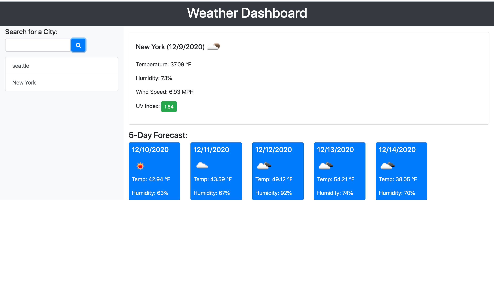

## Table of Contents 

* [Demo](#demo)

* [Description](#description)

* [DeployedApplicationLink](#deployedapplicationlink)

## Demo
 
 

## Description
In this app, the user enters the name of the city in the search field. The app will then show the current weather conditions in the city. Such as temperature, humidity, wind speed, uv index. As well as a 5 day forcast. Previous search history is saved below more recent searches. 

## Deployed Application Link
https://munaaahmed.github.io/weatherdashboard/

